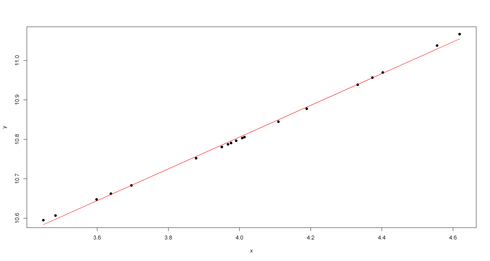

# Modelagem Estatistica

## Seções de estudos

### Primeira parte
* Feito em Jupyter, em **R** | **Python**
    1. [Teste de normalidade de atributos](/jupyter/seção-1/teste-de-normalidade.ipynb)
    2. [Fazendo teste com dataset mtcars R](/jupyter/seção-1/modelos-1.ipynb)

* Feido em **R-Markdown** :
    1. [oi]()?